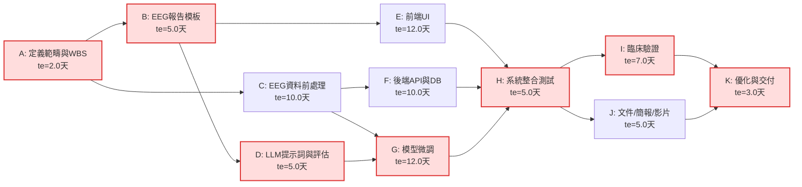
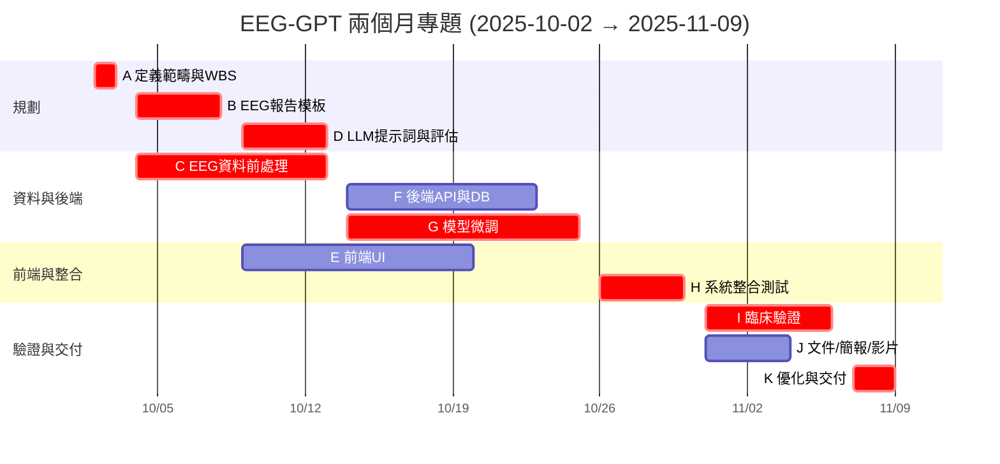

# EEG-GPT 兩個月專題計畫：PERT/CPM、甘特圖與關鍵路徑

> **時間範圍**：2025-10-02 ～ 2025-11-09。  

先做 EEG Report 的 背景活動，所以先設一個月。

---

## 任務清單與任務模式

B:最佳情況估計, P:可能情況估計, W:最差情況估計

| 任務ID | 任務名稱 | 前置任務 | PERT(B/P/W) (天) | 期望工期  | 時差 | 開始日期 | 結束日期 |
|---:|---|---|---|---:|---:|---|---|
| A | 定義範疇與工作分解 (WBS) | — | 1/2/3 | 2.0 | 0.0 | 2025-10-02 | 2025-10-03 |
| B | 完成 EEG 報告結構/模板 | A | 3/5/7 | 5.0 | 0.0 | 2025-10-04 | 2025-10-08 |
| C | EEG 資料前處理流程 | A | 6/10/14 | 10.0 | 0.0 | 2025-10-04 | 2025-10-13 |
| D | LLM 提示詞與評估設計 | B | 3/5/7 | 5.0 | 0.0 | 2025-10-09 | 2025-10-13 |
| E | 前端 UI（表單、PDF Viewer） | B | 7/12/15 | 12.0 | 3.0 | 2025-10-09 | 2025-10-20 |
| F | 後端 API 與資料庫整合 | C | 6/10/12 | 10.0 | 3.0 | 2025-10-14 | 2025-10-23 |
| G | 模型微調與推論模組 | C,D | 7/12/16 | 12.0 | 0.0 | 2025-10-14 | 2025-10-25 |
| H | 系統整合測試 | E,F,G | 3/5/7 | 5.0 | 0.0 | 2025-10-26 | 2025-10-30 |
| I | 臨床驗證與修正 | H | 4/7/10 | 7.0 | 0.0 | 2025-10-31 | 2025-11-06 |
| J | 文件、簡報與影片 | H | 3/5/7 | 5.0 | 2.0 | 2025-10-31 | 2025-11-04 |
| K | 系統優化與最終交付 | I,J | 2/3/5 | 3.0 | 0.0 | 2025-11-07 | 2025-11-09 |

---

## 1) PERT/CPM 網路圖

---

## 2) 甘特圖

## 3) 關鍵路徑：  
- `A → B → D → G → H → I → K`  
- `A → C → G → H → I → K`  
預估總工期約 **38 天**。  
